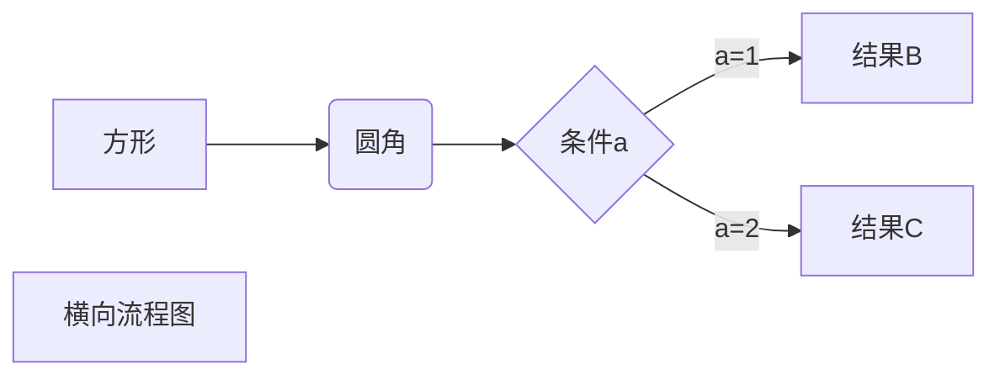
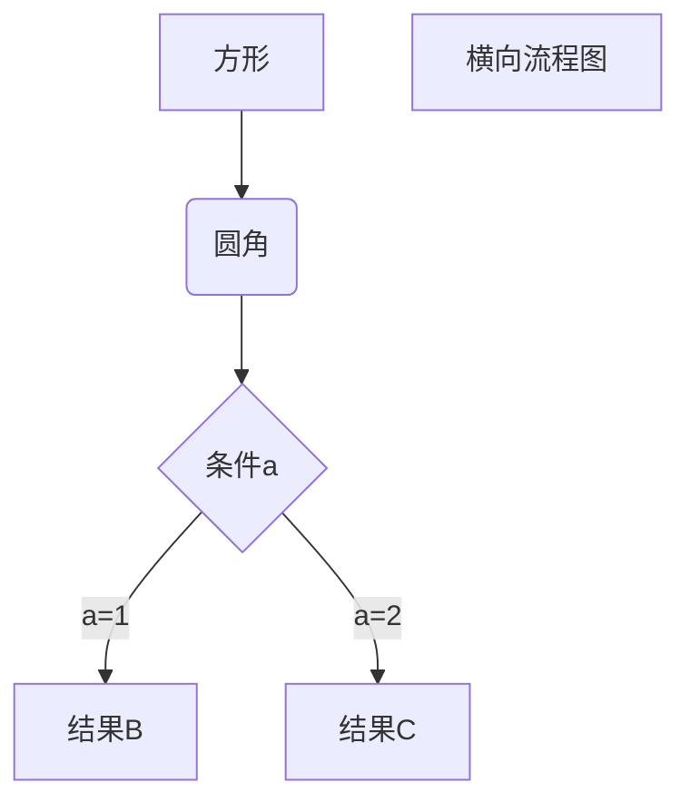

# markdown-notes

> 注：所有例子，上面时效果，下面是源码。

## 简单概述

#### 宗旨

Markdown 的目标是实现「易读易写」。

可读性，无论如何，都是最重要的。一份使用 Markdown 格式撰写的文件应该可以直接以纯文本发布，并且看起来不会像是由许多标签或是格式指令所构成。Markdown 语法受到一些既有 text-to-HTML 格式的影响，包括 [Setext](http://docutils.sourceforge.net/mirror/setext.html)、[atx](http://www.aaronsw.com/2002/atx/)、[Textile](http://textism.com/tools/textile/)、[reStructuredText](http://docutils.sourceforge.net/rst.html)、[Grutatext](http://www.triptico.com/software/grutatxt.html) 和 [EtText](http://ettext.taint.org/doc/)，而最大灵感来源其实是纯文本电子邮件的格式。

-----

#### 兼容HTML

不在 Markdown 涵盖范围之内的标签，都可以直接在文档里面用 HTML 撰写。不需要额外标注这是 HTML 或是 Markdown；只要直接加标签就可以了。但是需要注意，在 HTML 区块标签间的 Markdown 格式语法将不会被处理。

eg. 这里的双星不在做强调处理。

这是一个普通段落。

<table>
    <tr>
        <td>*Foo*</td>
    </tr>
</table>

这是另一个普通段落。

-----

 #### 特殊字符自动转换

特殊字符的转义字符，可以自动直接的转换进行展现

eg.

&copy;

```markdown
&copy;
```

A&amp;T

```markdown
AT&amp;T
```

&lt;

```
 &lt;
```

&gt;

```markdown
&gt;
```

&quot;

```markdown
&quot;
```

&nbsp;

```markdown
&nbsp;
```

------


## 基本语法

#### 标题

支持两种标题的语法，类 [Setext](http://docutils.sourceforge.net/mirror/setext.html) 和类 [atx](http://www.aaronsw.com/2002/atx/) 形式

```markdown
类 Setext 形式是用底线的形式，利用 = （最高阶标题）和 - （第二阶标题）

This is an H1
=============

This is an H2
-------------
```

```markdown
类 Atx 形式则是在行首插入 1 到 6 个 # ，对应到标题 1 到 6 阶
# 这是 H1

## 这是 H2

### 这是 H3

#### 这是 H4

##### 这是 H5

###### 这是 H6
```


#### 区块引用 Blockquotes

> 这是一个区块引用

> > 也可以使用多个 

> ###### 这是一个标题。

```markdown
> 这是一个区块引用
> > 也可以使用多个 
> ###### 这是一个标题。
```

#### 列表

##### 无序列表

+ 1
+ 2
	* a
		* bb
		
		- aa

```
在无序列表中 使用 { + ， - ， * }三个符号来标识无序列表，三者功能相同，相同层级下的列表表示建议使用相同的标识符，配合四个空白字符缩进，三者的组合则可以搭配出层级效果

+ 1
+ 2
	* a
		* bb
		- aa
		> bb
```

----

##### 有序列表

1. 第一
2. 第二
	+ a
	3\. 反斜杠避免被识别为有序列表
3. 第三

```markdown
使用数字接着一个英文句点，则是有序列表。可以配合使用缩进配合与无序列表，区块引用等配合使用

1. 第一
2. 第二
	+ a
3\. 反斜杠避免被识别为有序列表
3. 第三
```


#### 代码区块

```markdown
这是一个代码区块
```

这是``` 一个 ```小段 ``的`` 代码 `显示`

```markdown
代码区块可以进行缩进区分，或者使用六个个反引号来进行包围，前三个反引号之后可以跟着指定的代码格式。（这里使用\,是为了展示源码）

\	```markdown
\	这是一个代码区块
\	```

小段代码
这是``` 一个 ```小段 ``的`` 代码 `显示`
```


#### 分割线

* * *

***

*****

- - -

---------------------------------------

```markdown
一行中用三个以上的星号、减号、底线来建立一个分隔线，行内不能有其他东西。也可以在星号或是减号中间插入空格
* * *

***

*****

- - -

---------------------------------------
```


#### 链接

两种形式的链接语法： 行内式和参考式两种形式

----

###### 行内式

[示例1](http://www.baidu.com/ "百度") 链接中的title文字可以使用双引号包裹起来显示。
[示例2](http://www.baidu.com/) 这是一个链接。

[示例3](/about/) 相对路径链接.

```markdown
下面为行内式

[示例1](http://www.baidu.com/ "百度") 链接中的title文字可以使用双引号包裹起来显示。
[示例2](http://www.baidu.com/) 这是一个链接。

要链接到同样主机的资源，可以使用相对路径
[示例3](/about/) 相对路径链接.

参考式的链接是在链接文字的括号后面再接上另一个方括号，而在第二个方括号里面要填入用以辨识链接的标记
```

----

###### 参考式

[参考式][id] 此处引用的链接是参考，id标签中定义的.

[id][] 此处第二个标签中不指明使用的参考，默认会寻找与名称相同的标记链接

[id]: http://www.baidu.com/  "百度"

```markdown
参考式的链接是在链接文字的括号后面再接上另一个方括号，而在第二个方括号里面要填入用以辨识链接的标记
[参考式][id] 此处引用的链接是参考，id标签中定义的.
[id][] 此处第二个标签中不指明使用的参考，默认会寻找与名称相同的标记链接

接着，在文件的任意处，你可以把这个标记的链接内容定义出来
此处的注释 使用 "" , '' , () 三种标识效果相同，且注意需要 [] 后紧跟 ：
[id]: http://www.baidu.com/  "百度"  
```


#### 强调

*斜体-星号*

_斜体-下划线_

**加粗-星号**

__加粗-下划线__

```markdown
*斜体-星号*

_斜体-下划线_

**加粗-星号**

__加粗-下划线__
```


#### 图片

同样也允许两种样式： *行内式*和*参考式*

-------

###### 行内式

```markdown
与超链接相似，只是在·[]·前添加 !

```

----

###### 参考式

```markdown
同样与超链接的参考式相同 只是在`[]`前添加 `!`
!图片][id]

[id]: url/to/image  "图片注释"

注意这里的参考链接 `[]` 前不需要添加 `!`
```


#### 自动链接

Markdown 支持以比较简短的自动链接形式来处理网址和电子邮件信箱，只要是用方括号包起来， Markdown 就会自动把它转成链接

----

<http://www.baidu.com/>

<address@example.com>

```markdown
<http://www.baidu.com/>
<address@example.com>
```


#### 反斜杠

Markdown 可以利用反斜杠来插入一些在语法中有其它意义的符号，即转义字符，使得其后的字符不被markdown识别处理，方便与插入普通字符。


```markdown
\   反斜线
`   反引号
*   星号
_   底线
{}  花括号
[]  方括号
()  括弧
#   井字号
+   加号
-   减号
.   英文句点
!   惊叹号
```


## 其他

基于markdown可以适配html语言，所以我们也可以使用html语言中简单的标签来达到更多的扩展效果

----

#### 颜色设置

<font size="3" color="red">红色</font>

<font size="2" color="blue">蓝色</font>

```markdown
<font size="3" color="red">红色</font>
<font size="2" color="blue">红色</font>

```

 

#### 注脚

[^注脚]: https://www.appinn.com/markdown/

```markdown
与行内式的超链接相似,只是在`[]`中添加 `^`
[^注脚]: https://www.appinn.com/markdown/
```


#### 链接文件

[绝对地址文件](E:/Study/studyNote/Study/other-notes/git-nodes.md)
[相对地址文件](git-nodes.md)

```markdown
链接文件与超链接语法类似，
[绝对地址文件](E:/Study/studyNote/Study/other-notes/git-nodes.md)
[相对地址文件](git-nodes.md)
```

#### 流程图






```markdown
本质上是代码块，不过使用的语言是『mermaid』，详细操作可以查询『mermaid』

\ ```mermaid
方[方形] -->圆(圆角)
    圆 --> A{条件a}
    A -->|a=1| B[结果B]
    A -->|a=2| C[结果C]
    F[横向流程图]

\ ```


\ ```mermaid
graph TD
方[方形] -->圆(圆角)
    圆 --> A{条件a}
    A -->|a=1| B[结果B]
    A -->|a=2| C[结果C]
    F[横向流程图]

\ ```
```


---

待扩充


[^参考资料来源]: https://www.appinn.com/markdown/


