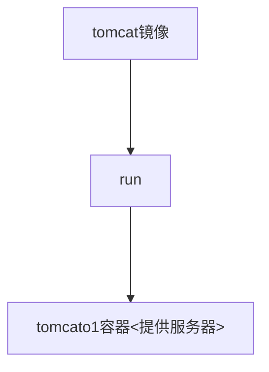

# docker-notes

## 基础


#### 基本组成


**镜像（image）：**

在docker中，镜像就类似于一个模板，可以通过这个模板来创建容器服务，同时也可以通过这个镜像去创建多个容器（最终服务运行或者项目运行就是在容器中）。




**容器（container）：**

Docker利用容器技术，独立运行一个或者一组应用，通过镜像来创建。

启动、停止、删除等基本命令！

**仓库（repository）：**

即存放镜像的地方，仓库分为私用仓库与公有仓库。但Docker Hub默认为国外服务器，所有已办通过配置为阿里云下镜像仓库来加速下载公用镜像。

*Docker与虚拟机技术的不同*

* 传统虚拟机，虚拟出硬件，运行一个完整的操作系统，然后再这个系统上安装和运行软件。
* 容器内的应用直接运行再宿主机的内容，容器是没有自己的内核的，也没有虚拟机的硬件，因此会轻便很多
* 每个容器间都是相互隔离的，每个容器都有一个属于自己的文件系统，互不影响。

*优点*

**应用更快速的交付和部署**

**更便捷的升级和扩缩容**

**更简单的系统运维**

**更高效的计算资源利用**


#### 安装Docker

> 环境查看

已在centos7上进行安装为例

```shell
# 查看系统内核版本
[root@centos7 ~]$ uname -r
```

```shell
# 查看系统版本
[root@centos7 ~]$ cat /etc/os-release
```

[官方手册](https://docs.docker.com/engine/install/ "install") https://docs.docker.com/engine/install/

> 开始安装

```shell

# 1、卸载历史版本的docker
[root@centos7 ~]$ yum remove docker \
                  docker-client \
                  docker-client-latest \
                  docker-common \
                  docker-latest \
                  docker-latest-logrotate \
                  docker-logrotate \
                  docker-engine
                  
# 2、安装基础安装包
[root@centos7]$ yum install -y yum-utils
 
# 3、设置镜像仓库
# yum-config-manager \
#    --add-repo \
#     https://download.docker.com/linux/centos/docker-ce.repo # 默认是国外仓库
    
[root@centos7 ~]$ yum-config-manager \
    --add-repo \
    http://mirrors.aliyun.com/docker-ce/linux/centos/docker-ce.repo # 阿里云的镜像地址
    
# 4、更新yum
[root@centos7 ~]$ yum makecache fast

# 5、安装 ce--社区，ee--企业  核心、客户端、容器
[root@centos7 ~]$ yum install docker-ce docker-ce-cli containerd.io
# 指定版本 yum install docker-ce--<VERSION_STRING> docker-ce-cli--<VERSION_STRING> containerd.io

# 6、启动
[root@centos7 ~]$ systemctl start docker

# 7、验证docker是否启动成功
[root@centos7 ~]$ docker version
[root@centos7 ~]$ docker run hello-world

# 8、查看下载的镜像
[root@centos7 ~]$ docker images
REPOSITORY    TAG       IMAGE ID       CREATED        SIZE
hello-world   latest    d1165f221234   4 months ago   13.3kB


```

> 快速卸载

```shell
# 1、卸载依赖 
[root@centos7 ~]$ yum remove docker-ce docker-ce-cli containerd.io

# 2、删除资源
[root@centos7 ~]$ rm -rf /var/lib/docker
[root@centos7 ~]$ rm -rf /var/lib/containerd

# /var/lib/docker docker的默认工作路径
```


> 镜像加速

```shell
# 以阿里云为列
[root@centos7 ~]$ mkdir -p /etc/docker # 创建文件
# 编写配置文件
[root@centos7 ~]$ tee /etc/docker/daemon.json <<-'EOF'
{
	"registry-mirrors":["https://qiyb9988.mirror.aliyuncs.com"]
}
EOF
[root@centos7 ~]$ systemctl daemon-reload # 编译配置文件
[root@centos7 ~]$ systemctl restart docker # 重启docker
[root@centos7 ~]$

```


[^主要引用]:https://www.bilibili.com/video/BV1og4y1q7M4?from=search&seid=8833819761241839370 "狂神说Docker"