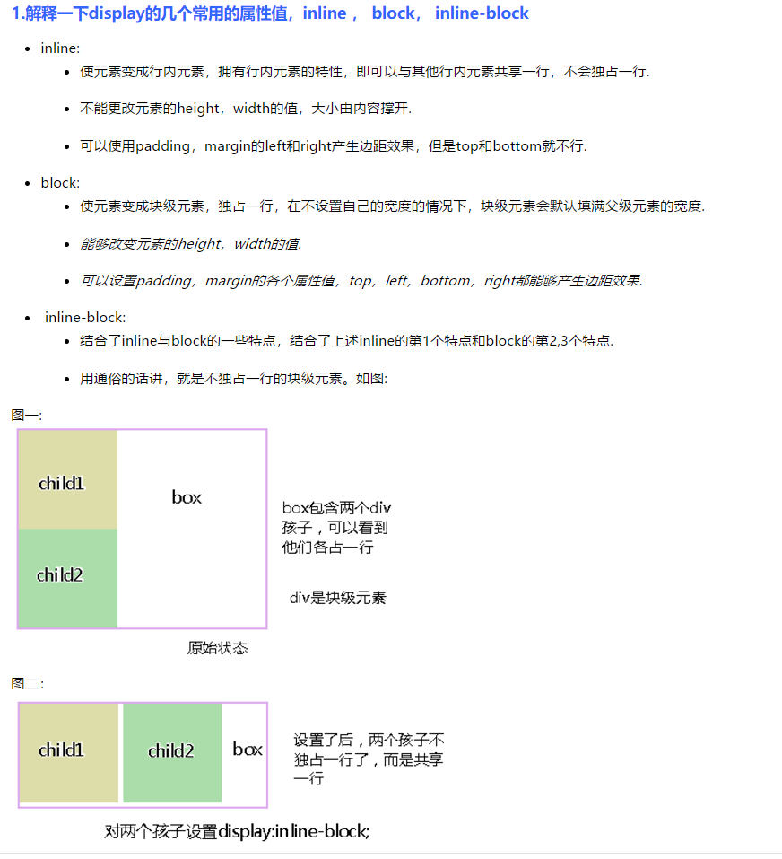

# web-notes


## 基本知识


#### 随手笔记

---

#####  id  与  class 的区别

```html
<div   id = 'one'>    </div>  

<div   class = 'two'>   </div> 
```

两者对应css的语法区别：

前者：#one{......} 只能被一个元素调用，在同一个页面中只可以被调用一次。

 后者： .two{.......}是类标签，在同一个页面中可以调用无数次，Class可以多个div用同一个Class。

 ID就像一个人的身份证，用于识别这个DIV，Class就像人身上穿的衣服，用于定义这个DIV的样式。


##### 关于 height=“100%”的问题

div的高度属性一般为缺省值，即 height = auto  。 要使一个元素可以达到 height = 100% ，则需要设置其所有父元素的高度熟悉为100%。

```css
   html,body{
        background: #1E90FF;
        z-index: 0;
        width: 100%;
        height: 100%;
    }
   /* body{
        margin: 0;
    }*/
```

以上虽然实现了div的高度为100%，但是右侧仍会出现了滚动条，这是因为body有一定的margin,也就是body默认有margin-top和margin-bottom所以设置100%高度之后body多余的margin值显示不完整，出现下拉滚动条，要想正确显示的话就要对body设置margin为0.


##### 关于垂直居中元素

[关于css垂直居中的八种](https://jingyan.baidu.com/article/3a2f7c2e26041a26aed61150.html)

其中第三种涉及到伪元素  #one.before与#one.after ，课另行查询。


##### display：block 与 inline-block的区别

注意：子模块之间的距离需要专门设置，否则子模块之间是并列的。即子模块之间是存在间隙的方式并列的，当然间隙也是可以去除的。



[^参考来源]:https://www.cnblogs.com/Ry-yuan/p/6848197.html


##### 关于flask与html之间传递json数据

```python
@app.route('/myaction') 
def dataConvector():
    mydata = json.loads(request.args.get('mykey'))
    onss = my_set.find_one({"name": mydata})
    print(type(onss))
    print(onss)
    del onss["_id"]
    print(onss)
    return jsonify(onss) #①
# /sendjson  响应的 url
@app.route('/sendjson', methods=['POST','GET'])
def sendjson():
    print(3)
    data = json.loads(request.form.get('datas')) #获得数据 get
    print(data)
    one = []
    for on in my_set.find({'name': re.compile(data)}):
        one.append(on["name"])
    print(one)
    print(len(one))
    return jsonify(one) #传递数据  post

```

```javascript
$("#123").bind("input propertychange change", function (event) {
        txt = $("#123").val();
        sss = {datas: JSON.stringify(txt)};
        if (txt) {
            $.ajax({
                url: "/sendjson",
                type: 'POST',
                data: sss, // ②
                success: function (data) {
                    fd(data)  //③       
                }
                 error: function(xhr, type) {  
                console.log(xhr);//接收到的object
                console.log(type)//错误类型
            }
            });
        }
    });
```

备注补充

```python
#一 

    #在传递数据时，需要将数据转换为json类型的数据，即双引号划分。
    #如果是单引号的话，需要使用json.dumps转为双引号的字符串传送
    data = [{'count': 80, 'geometry': {'coordinates': [106.664934, 29.037125], 'type': 'Point'}}, {'count': 80, 'geometry': {'coordinates': [106.53799, 29.588964], 'type': 'Point'}}
    data1=json.dumps(data)#转为双引号的字符串
    return jsonify(data1)#发送
```

```javascript
// 三

//接收的是json类型的字符串时（str），需要解析成为对象（数组）才可以进行操作

var points = 27;
var jsonStr= '[{'count': 80, 'geometry': {'coordinates': [106.664934, 29.037125], 'type': 'Point'}}, {'count': 80, 'geometry': {'coordinates': [106.53799, 29.588964], 'type': 'Point'}},++points]';
var eval_Json=eval('('+jsonStr+')'); //不报错此时age的值是28
var jsonParse_Json=JSON.parse(jsonStr);//报错
var obj = str.parseJSON(); //由JSON字符串转换为JSON对象

//区别，相对而言，
//安全性上：
    //JSON.parse()之可以解析json格式的数据，并且会对要解析的字符串进行格式检查，如果格式不正确则不进行解析，而eval()则可以解析任何字符串，eval是不安全的；   
//用eval可以解析，并且会弹出对话框，而用JSON.parse()则解析不了。 其实alert并没有什么坏处，可怕的是如果用恶意用户在json字符串中注入了向页面插入木马链接的脚本，用eval也是可以操作的，而用JSON.parse()则不必担心这个问题。
 //  注意：某些低级的浏览器尚不支持JSON.parse()

//JSON.parse()解析的必须是json格式的字符串要不报错，而eval()则没有这么严格:
 // eval本身的问题。 由于json是以”{}”的方式来开始以及结束的，在JS中，它会被当成一个语句块来处理，所以必须强制性的将它转换成一种表达式。
//加上圆括号的目的是迫使eval函数在处理JavaScript代码的时候强制将括号内的表达式（expression）转化为对象，而不是作为语句（statement）来执行。举一个例子，例如对象字面量{}，如若不加外层的括号，那么eval会将大括号识别为JavaScript代码块的开始和结束标记，那么{}将会被认为是执行了一句空语句。
/*解析部分参考自：
原文：https://blog.csdn.net/lululove19870526/article/details/49865581 ！
*/

```

```JavaScript
// 二

// 同样在发送数据的时候也应该是json类型的数据，故需要转为json类型的数据才可以正常发送
var last=obj.toJSONString(); //将JSON对象转化为JSON字符
//或者
var last=JSON.stringify(obj); //将JSON对象转化为JSON字符
alert(last);

//上面的几个方法中，除了eval()函数是js自带的之外，其他的几个方法都来自
//json.js包。新版本的 JSON 修改了 API，将 JSON.stringify() 和 
//JSON.parse() 两个方法都注入到了 Javascript 的内建对象里面，前者变
//成了 Object.toJSONString()，而后者变成了 String.parseJSON()。
//如果提示找不到toJSONString()和parseJSON()方法，则说明您的json包
//版本太低。
```

 **get与post的请求扩展**	https://www.jianshu.com/p/4350065bdffe


##### each() 循环

```javascript
$(selector).each(function(index,element))
//index - 选择器的 index 位置
//element - 当前的元素（也可使用 "this" 选择器）
```


##### 使用绝对定位时

```javascript
// 子类使用绝对定位时，需要给其父类设置为相对定位
// 父类
position: relative;

// 子类
   position : absolute;
```


## 其他

#### 相关参考网址

[jQuery插件库](https://www.jq22.com/)

[Bootstrap中文网](https://www.bootcss.com/)

[Bootstrap模板库](http://www.bootstrapmb.com/)

[highcharts中文网](https://www.highcharts.com.cn/)

[ant-design中文网](https://ant.design/index-cn)

[d3.js](https://d3js.org/)

[leaflet.js](https://leafletjs.com/)

[three.js](https://threejs.org/)

[three.js中文网](http://www.webgl3d.cn/)

